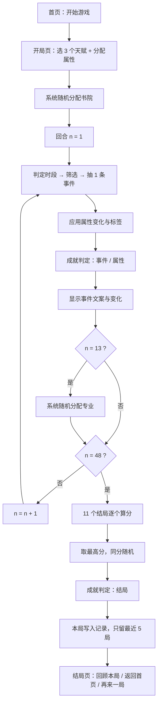
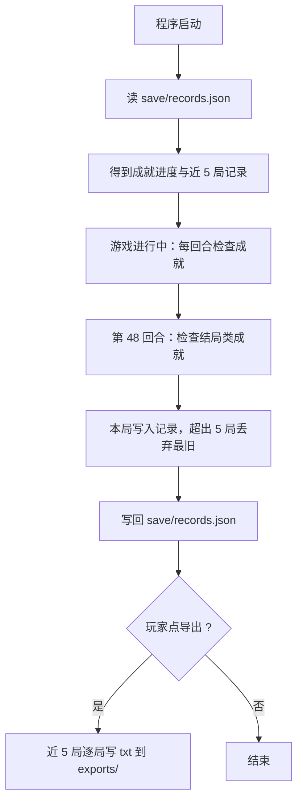

# 04 程序设计

> 状态：**已编写，按人类裁定同步更新（成就 / 回顾 / 导出），待确认**（准则八）
> 本文件描述"怎么做"（数据结构、算法、流程），不含可运行代码；模块划分见 `03-项目架构设计.md`。

## 1. 数据结构

### 1.1 玩家（内存中的一局数据）

| 字段 | 类型 | 含义 |
| --- | --- | --- |
| `shuyuan` | 字符串 | 书院（睿信 / 求是 / 明德 / 特立） |
| `major` | 字符串 | 专业；第 13 回合之前为空 |
| `attrs` | 字典 | 智力 / 体质 / 颜值 / 家境，**0.1 粒度、不封顶** |
| `tags` | 列表 | 经历标签（结局算分用） |
| `seen` | 列表 | 本局已出现过的特殊事件标识（去重用） |
| `months` | 列表 | 本局每月的「时间 + 事件文本」，供回顾与导出 |

### 1.2 事件（`data/events.json`）

| 字段 | 含义 |
| --- | --- |
| `text` | 事件文案 |
| `type` | `通用`（可重复）或 `特殊`（每局只出现一次） |
| `stage` | 时段：`常规` / `军训` / `期末` / `寒暑假` / `实习` / `答辩` |
| `need` | 属性下限，例如 `{"智力": 6}`；空字典表示不限 |
| `shuyuan` | 限定书院，空数组表示不限 |
| `major` | 限定专业，空数组表示不限 |
| `effects` | 属性变化，0.1 粒度，例如 `{"智力": 1.5, "体质": -0.5}` |
| `tags` | 结局标签 |

### 1.3 天赋（`data/talents.json`）

| 字段 | 含义 |
| --- | --- |
| `name` / `desc` | 名称与说明 |
| `effects` | 开局属性加成，幅度 1–2 |
| `shuyuan` | 非空则直接指定书院 |
| `boost` | `{标签: 倍率}`，提高带该标签事件的抽取概率 |

### 1.4 结局（`data/endings.json`）

| 字段 | 含义 |
| --- | --- |
| `name` / `text` | 结局名称与文案 |
| `weights` | `{属性名或标签: 权重}` |

### 1.5 成就（`data/achievements.json`）

| 字段 | 含义 |
| --- | --- |
| `name` / `desc` | 成就名称与说明 |
| `type` | 达成类型：`结局` / `事件` / `属性` |
| `value` | 条件值：结局名 / 特殊事件文案 / `{属性名: 数值}` |

### 1.6 存档（`save/records.json`）

| 字段 | 含义 |
| --- | --- |
| `achievements` | 已达成成就名称列表（跨局累计） |
| `games` | 最近 5 局记录列表；每局含书院、专业、结局名、每月文本 |

## 2. 关键算法

### 2.1 回合与年月换算

- 第 1 回合 = 大一 9 月；第 48 回合 = 大四 8 月
- 设回合号 n：`下标 = (n-1) 除以 12 的余数`，`月份 = (8 + 下标) 除以 12 的余数 + 1`，`学年 = (n-1) 除以 12 的商 + 1`

### 2.2 时段判定（互不重叠，无需优先级）

| 判定条件（按书写顺序） | 时段 |
| --- | --- |
| 学年 1 且月份 9 | 军训 |
| 学年 4 且月份 3–5 | 实习 |
| 学年 4 且月份 6 | 答辩 |
| 月份 1，或（月份 6 且学年不为 4） | 期末 |
| 月份 2、7、8 | 寒暑假 |
| 其余 | 常规 |

对应回合：军训第 1；期末第 5、10、17、22、29、34、41；实习第 43–45；答辩第 46；寒暑假共 12 个回合；常规共 24 个回合。

### 2.3 事件筛选（每回合 1 条）

1. 筛出**时段匹配**且**条件满足**的事件（属性下限、书院、专业）
2. 排除本局已出现过的**特殊事件**（通用事件可重复）
3. 按权重随机抽 1 条：初始权重 1；若事件带天赋 `boost` 里的标签，权重乘以对应倍率
4. 没有候选时，显示"这个月没什么特别的事"

### 2.4 结局判定（第 48 回合）

    每个结局得分 = Σ(属性值 × 权重) + Σ(该标签出现次数 × 权重)

- 取**最高分**的结局；**同分时在最高分的结局里随机取一个**

### 2.5 专业分配（第 13 回合）

从该玩家书院对应的专业列表里随机取一个。

### 2.6 属性变化规则

- 分配阶段：整数点，每项上限 10，20 点可以分不完
- 事件与天赋：0.1 粒度，可正可负，**不封顶**

### 2.7 成就判定

- **每回合结束后**检查两类：`事件`（本回合触发的特殊事件是否命中）与 `属性`（某属性是否达到指定数值）
- **第 48 回合结局判定后**检查一类：`结局`（本局结局是否命中）
- 命中且尚未达成 → 追加到存档的 `achievements` 列表（跨局累计，不重复）
- 成就判定只看"是否达到过"，达到后再下降不影响已达成状态

### 2.8 记录与导出

- **记录**：每局结束时把该局（书院、专业、结局名、每月文本）写入 `save/records.json` 的 `games` 列表；**只保留最近 5 局**（超出时丢弃最旧的）
- **读取**：程序启动时读 `save/records.json`，得到成就进度与近 5 局记录
- **导出**：把近 5 局逐局写成 txt，输出到 `exports/` 目录，**每局一个文件**，文件名含日期与该局结局

### 2.9 响应式缩放（竖屏）

- 基准画幅 **540 × 960**（见 `05-页面设计.md`）；窗口可拉伸
- 每帧按当前窗口宽高计算：**缩放系数 =（窗口宽 ÷ 540）与（窗口高 ÷ 960）中的较小值**
- 坐标换算：`实际坐标 = 基准坐标 × 缩放系数 + 居中偏移`
- 居中偏移 =（（窗口宽 − 540 × 系数）÷ 2，（窗口高 − 960 × 系数）÷ 2）
- 字号、圆角、线宽同样乘以缩放系数；四周留白用背景色填充
- 鼠标点击判定用同一套换算，保证缩放后点击位置准确

### 2.10 月度日志（滚动）

- 主界面保留**本局全部已发生月份**的文本，按时间从上到下排列，最新在底部
- 日志区高度固定（基准 640），内容超出时用滚轮 / 上下键滚动
- **默认跟到最新**：每次推进后视图自动滚到底部
- 用户向上滚动后**停止跟随**；重新滚回底部后恢复跟随

### 2.11 暂停与中途结束

- 在游戏主界面按 ESC 或点「暂停」→ 进入暂停页；暂停页按 ESC → 返回游戏
- 「继续游戏」→ 回到游戏主界面
- 「结束并返回首页」→ **把本局写入记录**（结局记为 `中途结束`）、写回存档、回到首页

### 2.12 视觉绘制

- **背景渐变**：竖向渐变（`#FFFFFF` → `#EAF4EE`）；生成一次位图缓存，窗口尺寸变化时重建
- **主按钮渐变**：`#1B9849` → `#0E7A38`
- **装饰**：顶部 6 像素装饰条、卡片左侧 4 像素色条、标题下 60 × 4 圆角短线
- 渐变用逐行画水平线实现（pygame 无原生渐变接口），结果缓存在位图里避免每帧重算
## 3. 流程图

### 3.1 整局流程



### 3.2 单回合事件抽取

```mermaid
flowchart TD
    A[进入本回合] --> B[计算年月与时段]
    B --> C[遍历事件池]
    C --> D{时段匹配 ?}
    D -->|否| C
    D -->|是| E{属性/书院/专业条件满足 ?}
    E -->|否| C
    E -->|是| F{是特殊事件且本局已出现 ?}
    F -->|是| C
    F -->|否| G[加入候选，按天赋 boost 计算权重]
    G --> H{还有事件 ?}
    H -->|是| C
    H -->|否| I{候选为空 ?}
    I -->|是| J[显示"这个月没什么特别的事"]
    I -->|否| K[按权重随机抽 1 条]
    K --> L[应用属性变化、记录标签与已出现、记入本局 months]
    L --> M[返回文案与变化]
```

### 3.3 成就与记录



## 4. 模块与函数职责

| 模块 | 主要函数 | 作用 |
| --- | --- | --- |
| `game/data.py` | `load_data` | 读四份 JSON 文案 |
| | `assign_major` | 按书院随机分专业 |
| `game/player.py` | `new_player` | 新建一局，随机书院 |
| | `apply_talents` | 应用选中的 3 个天赋 |
| | `collect_boosts` | 汇总天赋的抽事件加成 |
| `game/timeline.py` | `month_text` | 回合 → 学年与月份 |
| | `stage_of` | 学年月份 → 时段 |
| `game/events.py` | `can_use` | 判断事件能否触发 |
| | `pick_event` | 筛选并按权重抽取 |
| | `apply_event` | 应用效果，返回变化文字 |
| `game/endings.py` | `judge_ending` | 结局算分与选取 |
| `game/achievements.py` | `check_achievements` | 按类型检查并返回新达成的成就 |
| `game/records.py` | `load_records` | 读存档（成就进度 + 近 5 局） |
| | `save_record` | 写入本局，只保留最近 5 局 |
| | `export_records` | 近 5 局导出为 txt |

## 5. 已裁定事项

| 序号 | 事项 | 裁定 |
| --- | --- | --- |
| 1 | 流程图格式 | **Mermaid** |
| 2 | 导出文件 | **txt 文件**，每局一个；文件名格式 `YYYY-MM-DD_结局.txt` |
| 3 | 存档损坏处理 | **不处理**（按准则一不做兜底） |