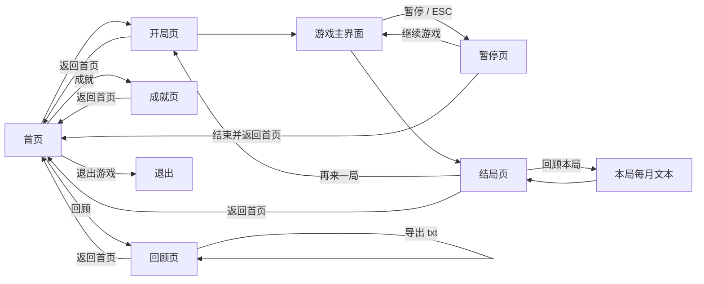

# 05 页面设计

> 状态：**已编写，按人类新增要求重做视觉风格并新增暂停页，待确认**（准则八）
> 本文件只写界面布局与风格，不含代码；玩法规则见 `02-游戏设计.md`，算法见 `04-程序设计.md`。

## 1. 画幅与响应式

| 项 | 规定 |
| --- | --- |
| 基准画幅 | **竖屏 540 × 960** |
| 窗口 | 可拉伸 |
| 响应式规则 | 缩放系数 = 窗口宽 ÷ 540 与 窗口高 ÷ 960 中的**较小值**；内容按该系数等比缩放并**居中**，四周留白 |
| 坐标定义 | 本文件所有坐标、字号、圆角、间距都按 **540 × 960 基准坐标**给出，绘制时统一乘以缩放系数 |
| 字体 | 系统字体（微软雅黑） |

## 2. 视觉风格

### 2.1 配色

| 用途 | 色值 | 说明 |
| --- | --- | --- |
| 背景渐变起 | `#FFFFFF` | 学校标准主色（白） |
| 背景渐变止 | `#C6DED0` | 加深的浅绿，自上而下渐变 |
| 卡片底 | `#FFFFFF` | |
| 卡片描边 | `#E3E7EE` | 1 像素细线 |
| 主强调（北理绿） | `#1B9849` | 主按钮、标题装饰、选中态 |
| 主强调深 | `#0E7A38` | 主按钮渐变的下端 |
| 浅绿底（辅助色） | `#E8F4EC` | 标签、选中卡片底色 |
| 次强调（褐色） | `#A13E0B` | 分专业提示、属性负向变化 |
| 浅褐底（辅助色） | `#FBF0EA` | 提示条底色 |
| 达成色（墨绿） | `#005B30` | 成就已达成、属性正向变化 |
| 主文字 | `#1D2129` | 标题与正文 |
| 次文字 | `#6B7280` | 说明、辅助信息 |
| 分隔线 | `#E3E7EE` | |

> 说明：`color.txt` 记为「北理绿：`#0A308F`」，但该色值是深蓝、与名称不符；经人类裁定，**北理绿改用 `#1B9849`**。

### 2.2 装饰元素（提升设计感）

| 装饰 | 规定 |
| --- | --- |
| 背景渐变 | 整个页面自 `#FFFFFF` 到 `#EAF4EE` 竖向渐变 |
| 卡片左边条 | 卡片左侧 4 像素宽的实心主强调色竖条（圆角同卡片） |
| 游戏页下划线 | 游戏主界面「书院·专业」行与「属性」行下方各加一条主强调色细线，宽度与文字等宽 |
| 主按钮渐变 | 主按钮用 `#1B9849` → `#0E7A38` 竖向渐变 |
| 分隔线 | 1 像素 `#E3E7EE` 细线，上下留白各 12 |
| 提示条 | 需要强调的提示（如分专业）用浅褐底 `#FBF0EA` + 次强调色文字 |

### 2.3 字体与字号（基准坐标）

| 层级 | 字号 | 用途 |
| --- | --- | --- |
| 大标题 | 48 | 首页标题，**像素字体 Zpix**、关闭抗锯齿 |
| 标题 | 26–30 | 界面标题、结局名、时间 |
| 正文 | 19–22 | 事件文案、属性 |
| 辅助 | 15–17 | 说明、书院专业、达成条件 |

### 2.4 形状与留白（避免文本推挤）

| 项 | 规定 |
| --- | --- |
| 圆角 | 按钮 12；卡片 16；小色块 8 |
| 页边距 | 左右各 30 |
| 区块间距 | 32 |
| 卡片间距 | 16 |
| 正文行高 | 34 |
| 属性行间距 | 14 |
| 文本与边框 | 文字距卡片边缘至少 20，不贴边 |
| 按钮高度 | 64（保证点按区域足够） |

## 3. 界面清单与状态机

| 界面 | 说明 |
| --- | --- |
| 一、首页 | 大标题 + 四个按钮 |
| 二、开局页 | 天赋与属性合为一页；含「返回首页」 |
| 三、游戏主界面 | 月度日志（可滚动）+ 继续 / 自动 / 速度 / 暂停 |
| 四、暂停页 | 继续游戏 / 结束并返回首页 |
| 五、结局页 | 结局文案 + 回顾本局 / 返回首页 / 再来一局 |
| 六、成就页 | 成就列表与达成状态 |
| 七、回顾页 | 近 5 局记录，可查看与导出 |

## 4. 界面一：首页

    ┌──────────────────────┐  540 × 960
    │                      │
    │   BIT重开模拟器       │  大标题，像素字体，居中，y≈210
    │                      │
    │    ┌────────────┐    │
    │    │  开始游戏   │    │  y=460，宽 300，高 64
    │    └────────────┘    │
    │    ┌────────────┐    │
    │    │   成  就   │    │  y=540（次按钮）
    │    └────────────┘    │
    │    ┌────────────┐    │
    │    │   回  顾   │    │  y=620（次按钮）
    │    └────────────┘    │
    │    ┌────────────┐    │
    │    │  退出游戏   │    │  y=700（次按钮）
    │    └────────────┘    │
    └──────────────────────┘

| 控件 | 位置（基准坐标） | 行为 |
| --- | --- | --- |
| 大标题 | 居中，y=210，字号 48 | 「BIT重开模拟器」，像素字体 Zpix，无下划线 |
| 开始游戏 | (120, 460, 300, 64) | 主按钮（渐变）→ 开局页 |
| 成就 | (120, 540, 300, 64) | 次按钮 → 成就页 |
| 回顾 | (120, 620, 300, 64) | 次按钮 → 回顾页 |
| 退出游戏 | (120, 700, 300, 64) | 次按钮 → 关闭程序 |

## 5. 界面二：开局页（天赋 + 属性）

    ┌──────────────────────┐
    │ 选择天赋（5 选 3）    │  y=30
    │ ┌──────────────────┐ │
    │ ┃ 天赋名称 / 说明   │ │  卡片 x=30，宽 480，高 66
    │ └──────────────────┘ │  左侧 4px 色条；起始 y=62，间距 74
    │  ……共 5 个           │
    │                      │
    │ 分配属性点（0-10）[随机分配][清零] │  y=444，按钮同排（高 36）
    │ ┌──────────────────┐ │
    │ ┃ 智力 0    [-] [+] │ │  属性卡片 x=30，宽 480，高 52
    │ └──────────────────┘ │  起始 y=486，间距 60
    │  ……共 4 行           │
    │  剩余点数：20         │  y=732
    │ [返回首页] [   开始   ]│  y=850
    └──────────────────────┘

| 控件 | 位置 | 行为 |
| --- | --- | --- |
| 天赋卡片 ×5 | x=30，宽 480，高 66，起始 y=62，间距 74 | 点击切换选中，最多 3 个；选中时描边变主强调色、底色变浅绿 |
| **属性卡片 ×4** | x=30，宽 480，高 52，起始 y=486，间距 60 | **每项属性一张卡片**（圆角 + 描边 + 左侧色条）；名称 x=50、数值 x=180、「-」x=300、「+」x=360 |
| 剩余点数 | (50, 732) | 实时更新 |
| **「随机分配」** | (300, 440, 100, 36) | **与标题同排的小按钮**；把剩余点数随机分到四项属性（每项不超过 10） |
| **「清 零」** | (410, 440, 100, 36) | **与标题同排的小按钮**；属性全部清零，剩余点数恢复 20 |
| 「返回首页」 | (30, 850, 150, 64) | 次按钮 → 回到首页 |
| 「开始」 | (195, 850, 315, 64) | 主按钮；选满 3 个天赋即可开始 |

## 6. 界面三：游戏主界面

    ┌──────────────────────┐
    │ 大二3月               │  (30, 30)
    │ 书院：睿信 专业：软件 │  (30, 70) + 下划线
    │ 智力 8.5 体质 5 …     │  (30, 110) + 下划线
    │ ──────────────────── │  y=158 分隔线
    │ 大二3月（最新）        │  ┐
    │ ……                    │  │ 月度日志区
    │ 大一10月              │  │ x=30, y=205, 宽 480, 高 610
    │ 大一9月               │  │ 最新在顶端，可滚动
    │ 军训第一天……          │  ┘
    │ [继续][自动][速度][暂停]│  y=860
    └──────────────────────┘

| 区域 | 位置 | 内容 |
| --- | --- | --- |
| 时间 | (30, 30) | 如「大二3月」 |
| 书院与专业 | (30, 70) | 专业未分配时只显示书院 |
| 属性行 | (30, 110) | 四项属性当前值（去掉多余小数位） |
| 书院·专业下划线 | y=94 | 主强调色细线，宽度与文字等宽 |
| 属性下划线 | y=138 | 主强调色细线，宽度与文字等宽 |
| 分隔线 | y=158 | 1 像素细线 |
| **月度日志** | (30, 205, 480, 610) | **本局所有已发生月份的文本**；**最新月份显示在顶端**，视图默认定位在顶端，向下滚动查看历史 |
| 日志条目 | 每条 | 月份（主强调色，19 号）+ 事件文案（正文色，17 号，自动换行），条目间距 12 |
| 分专业提示 | 日志顶部 | 用浅褐底提示条 + 次强调色文字 |
| 「继续」 | (30, 860, 150, 64) | 主按钮，推进一个月 |
| 「自动:开/关」 | (190, 860, 120, 64) | 切换自动推进，开启时用主强调色 |
| 速度按钮 | (320, 860, 90, 64) | 「1 秒 / 2 秒 / 4 秒」循环切换 |
| 「暂停」 | (420, 860, 90, 64) | 次按钮 → 暂停页（**新增**） |

## 7. 界面四：暂停页（新增）

    ┌──────────────────────┐
    │  （下层游戏界面 + 半透明白遮罩）│
    │                      │
    │   ┌──────────────┐   │
    │   │     暂停      │   │  面板 (60, 330, 420, 300)
    │   │ ┌──────────┐ │   │
    │   │ │ 继续游戏  │ │   │  (120, 430, 300, 64)
    │   │ └──────────┘ │   │
    │   │ ┌──────────┐ │   │
    │   │ │结束并返回首页│ │   │  (120, 520, 300, 64)
    │   │ └──────────┘ │   │
    │   └──────────────┘   │
    └──────────────────────┘

| 控件 | 位置 | 行为 |
| --- | --- | --- |
| 遮罩 | 全屏 | 半透明白（不透明度约 80%），下层保留游戏界面 |
| 面板 | (60, 330, 420, 300) | 白底 + 描边 + 圆角 16 + 左侧色条 |
| 「暂停」标题 | 面板顶部居中 | 标题字号 + 下划线 |
| 「继续游戏」 | (120, 430, 300, 64) | 主按钮 → 回到游戏主界面 |
| 「结束并返回首页」 | (120, 520, 300, 64) | 次按钮 → 本局**计入记录**（结局记为「中途结束」）并回到首页 |
| ESC 键 | — | 在游戏主界面按 ESC 打开暂停页；在暂停页按 ESC 继续游戏 |

## 8. 界面五：结局页

    ┌──────────────────────┐
    │ 结局：保研本校        │  (30, 60) + 下划线
    │                      │
    │ 结局文案第一行……      │  (30, 150 起)
    │ 结局文案第二行……      │  宽 480，行高 34
    │                      │
    │ 书院：睿信 专业：软件 │  (30, 640)
    │ [回顾本局][返回首页][再来一局] │ y=850
    └──────────────────────┘

| 控件 | 位置 | 行为 |
| --- | --- | --- |
| 结局名 | (30, 60) | 标题字号 + 下划线 |
| 结局文案 | (30, 150 起) | 自动换行，行高 34 |
| 书院与专业 | (30, 640) | 辅助字号 |
| 「回顾本局」 | (30, 850, 150, 64) | 次按钮 → 本局每月文本（可滚动） |
| 「返回首页」 | (195, 850, 150, 64) | 次按钮 → 首页 |
| 「再来一局」 | (360, 850, 150, 64) | 主按钮 → 开局页 |

## 9. 界面六：成就页

    ┌──────────────────────┐
    │ 成就（已达成 3 / 20） │  (30, 30) + 下划线
    │ ──────────────────── │
    │ ┃ ✔ 保研上岸          │  左侧 4px 色条 + 浅绿底
    │   达成结局：保研本校  │
    │ ┃ ✘ 学霸              │  未达成用次文字色
    │   智力达到 9          │
    │ ……（可滚动）          │
    │   [ 返回首页 ]        │  (120, 860, 300, 64)
    └──────────────────────┘

| 控件 | 位置 | 行为 |
| --- | --- | --- |
| 标题 | (30, 30) | 「成就（已达成 X / Y）」 |
| 成就列表 | y=90 起，行高 72 | 每条两行；已达成用浅绿底 + 达成色文字 + 左侧色条 |
| 滚动 | 列表区 | 条目超过一屏时用鼠标滚轮 / 上下键滚动 |
| 「返回首页」 | (120, 860, 300, 64) | 次按钮 → 首页 |

## 10. 界面七：回顾页

    ┌──────────────────────┐
    │ 回顾（近 5 局）       │  (30, 30) + 下划线
    │ ──────────────────── │
    │ ┃ 第 1 局             │  y=90 起，行高 72
    │   睿信 · 软件工程 · 保研│  点击查看该局每月文本
    │ ┃ 第 2 局             │
    │   明德 · 法学 · 待业   │
    │ ……                    │
    │ [ 导出 txt ][ 返回首页 ]│ y=860
    └──────────────────────┘

| 控件 | 位置 | 行为 |
| --- | --- | --- |
| 标题 | (30, 30) | 「回顾（近 5 局）」 |
| 局记录列表 | y=90 起，行高 72 | 每局两行：第 N 局 + 书院 · 专业 · 结局；点击进入该局每月文本 |
| 单局详情 | 覆盖列表区，可滚动 | 显示该局每月时间与事件文本，可返回列表 |
| 「导出 txt」 | (30, 860, 200, 64) | 次按钮 → 导出到 `exports/` |
| 「返回首页」 | (245, 860, 265, 64) | 次按钮 → 首页 |

## 11. 交互汇总

| 方式 | 行为 |
| --- | --- |
| 鼠标左键 | 首页选按钮、选天赋、分配属性、点底部按钮、点局记录（**仅左键有效；右键、中键、滚轮均不触发按钮**） |
| 键盘 | 空格 / 回车推进一个月（仅游戏主界面）；**ESC 打开/关闭暂停页**；上下键滚动 |
| 鼠标滚轮 | 滚动月度日志、成就列表、单局详情 |
| 自动推进 | 开启后每 1 / 2 / 4 秒自动推进一条 |
| 窗口拉伸 | 内容按缩放系数等比缩放并居中，四周留白 |
| 关闭窗口 | 退出程序 |

## 12. 已裁定事项

| 序号 | 事项 | 裁定 |
| --- | --- | --- |
| 1 | 画幅 | 竖屏 540 × 960 |
| 2 | 响应式 | 等比缩放 + 居中留白 |
| 3 | 北理工特色 | 只用配色（不用校徽、不用校训文字） |
| 4 | 配色来源 | `color.txt`；「北理绿」用 `#1B9849` |
| 5 | 属性显示 | 去掉多余小数位 |
| 6 | 首页按钮 | 开始游戏 / 成就 / 回顾 / 退出游戏，居中 |
| 7 | 天赋与属性 | 合并为一页，上下分区 |
| 8 | 导出格式 | txt 文件 |
| 9 | 成就条目 | 写文案阶段一并设计 |
| 10 | 视觉风格 | 渐变背景 + 边框 + 卡片色条 + 标题下划线 + 浅色辅助底 |
| 11 | 开局页 | 增加「返回首页」按钮 |
| 12 | 暂停 | 暂停按钮 + ESC；暂停页两项 |
| 13 | 月度日志 | 保留全部月份文本，从上到下，可滚动，默认跟到最新 |
| 14 | 中途结束 | 计入记录，结局记为「中途结束」 |
| 15 | 顶部装饰条 / 标题下划线 | **去除** |
| 16 | 游戏页下划线 | 「书院·专业」与「属性」行下方各加一条 |
| 17 | 背景渐变 | 加深为 #FFFFFF → #C6DED0 |
| 18 | 大标题 | 改为「BIT重开模拟器」，字号 48，像素字体 Zpix |
| 19 | 属性分配 | 每项属性加卡片边框 |
| 20 | 属性按钮 | 新增「随机分配」「清零」，**缩小后与「分配属性点」标题同排** |
| 21 | 日志顺序 | **最新月份在顶端，视图定位在顶端** |